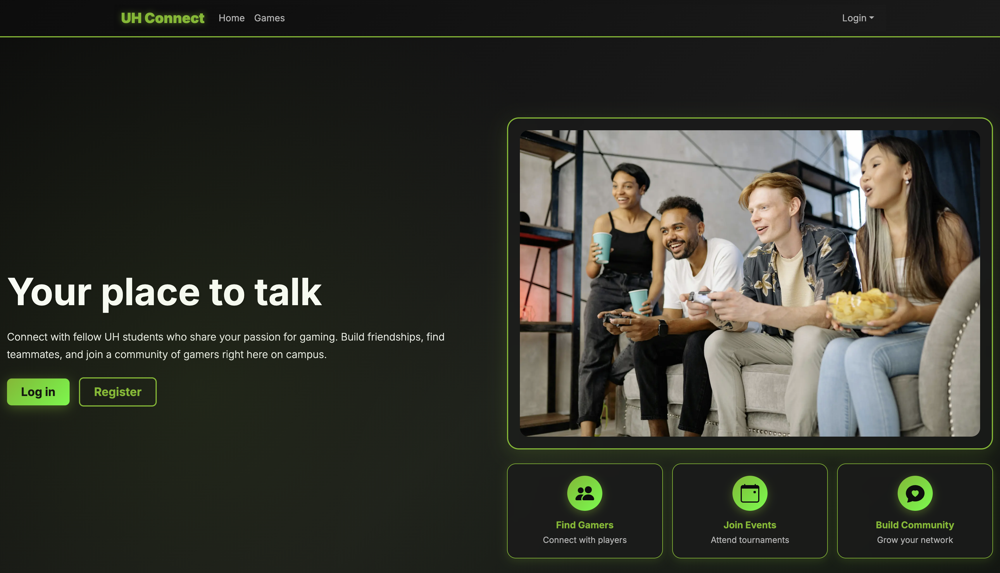

##UH Connect

UH Connect is a web application designed to help UH students discover and connect with other gamers on campus based on their favorite games, skill levels, gaming goals such as casual play, ranked competition, or streaming, and their availability. By creating detailed gamer profiles, students can clearly express their interests and play styles, making it easier to find compatible players to game with. The platform also includes events that can be created by players or officially organized by the UH Gaming Club, allowing students to discover tournaments, casual meetups, and other gaming activities that strengthen the campus gaming community.

##Technologies and Tools Used

UH Connect was developed using modern, industry-standard technologies to support a scalable full-stack web application. The frontend was built with React, Next.js, and TypeScript, enabling reusable components and dynamic page rendering, while Bootstrap 5 and React-Bootstrap were used to ensure a responsive and consistent user interface across devices. Server-side functionality was implemented using Next.js Server Actions and API routes, which handled authentication, data processing, and communication with the database. The backend uses Prisma ORM for schema modeling and database interactions, with PostgreSQL providing reliable persistent data storage. User authentication was managed through NextAuth, enabling secure session handling and protected routes, and the application was deployed on Vercel, allowing seamless continuous deployment and environment configuration.

##My Contributions to Gamer Connects:

-Designed and implemented the UI for sign-up, sign-in, logout, and change password pages, focusing on clarity, usability, and consistent styling

-Designed and implemented the admin page UI, ensuring a clean and intuitive interface for content management

-Implemented the authentication system, including sign-up, sign-in, logout, and change password functionality, with secure access control

-Developed admin functionality that allows authorized users to add and manage games and events

-Integrated backend data so that events added by admins appear dynamically on the homepage

-Integrated backend data so that games added by admins appear dynamically on the game page

Participated actively in GitHub project management by creating and resolving issues, working with feature branches, submitting pull requests, and collaborating with teammates during code reviews and debugging sessions.

##Skills and Lessons Learned

Working on Gamer Connects significantly strengthened my understanding of full-stack development and collaborative software engineering. I learned how to design authenticated user flows, manage role-based access control, and integrate frontend components with backend data sources. I also gained experience debugging issues that appeared only in production environments, particularly when deploying with Vercel.

This project reinforced the value of clean code, consistent styling, and clear communication within a development team. By the end of the project, I felt much more confident in my ability to build, deploy, and maintain a full-stack web application using modern tools and professional workflows.

Source: [UH Connect](https://uh-connect.vercel.app/)
